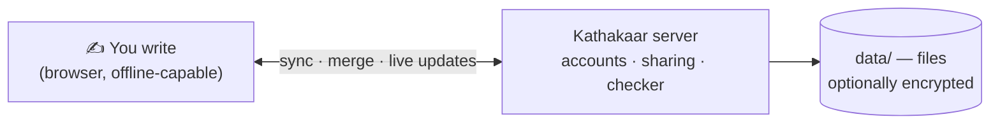

# Kathakaar (कथाकार)

*Kathakaar* means "storyteller". It is a **story planner and writing studio** for novelists and screenwriters: plan events on timelines, track characters, places, props and relationships, write the manuscript inside the plan, export to DOCX/EPUB/PDF/Fountain/FDX — and let the app warn you when the story contradicts its own rules.

It is **local-first** (works offline, saves in your browser), with an optional Node.js server for sync, **multi-user accounts**, sharing, and semantic consistency checks. No framework, no build step, no runtime dependencies.



## Quick start

```bash
node -v          # 18 or newer
npm start        # open http://localhost:3000
```
Open **Kathākośa** in the sidebar to try the two finished example stories, or press **+ New story**.

Optional: `npm run setup-model` (better meaning-based checks, ~100 MB). Everything else works without it.

## Documentation

| Read this | If you want to… |
|---|---|
| [User guide](docs/USER_GUIDE.md) | Learn every tab, workflow, shortcut, export and the rules checker |
| [Multi-user & sharing](docs/MULTI_USER.md) | Understand accounts, sessions, roles, sharing, quotas |
| [Admin CLI](docs/ADMIN_CLI.md) | Create admins, reset forgotten passwords, delete users |
| [Deployment](docs/DEPLOYMENT.md) | Run a **public** site with HTTPS, backups, updates |
| [Configuration](docs/CONFIGURATION.md) | Every environment variable and recommended presets |
| [Security](docs/SECURITY.md) | Threat model, hardening, limitations, launch checklist |
| [Architecture](docs/ARCHITECTURE.md) | Diagrams of storage, sync, requests, data model |
| [API reference](docs/API.md) | HTTP endpoints, status codes, examples |
| [Development](docs/DEVELOPMENT.md) | Code map, conventions, tests, how to add features |
| [Troubleshooting](docs/TROUBLESHOOTING.md) | Symptom → fix tables |
| [Feature notes](docs/FEATURE_NOTES.md) | Historical per-version technical notes |
| [Audit report](BUGS_FIXED.md) | Bugs found/fixed and what remains |

## Choose how to run it

| You are… | Do this |
|---|---|
| A writer on one computer | `npm start` — nothing else |
| A family/team on a private server | `KATHAKAAR_MULTIUSER=1`, `KATHAKAAR_SIGNUP=0`, accounts via CLI |
| Hosting a public platform | `docker compose -f docker-compose.prod.yml --env-file .env.production up -d --build`, then `node server/tools/admin.js create-admin <you>` inside the container ([Deployment](docs/DEPLOYMENT.md)) |

## Highlights

* **Plan**: Journey map, Corkboard/Kanban, Matrix (place × time), Life timelines, custom Calendar with moon cycles.
* **Write**: novel/screenplay renderer, Edit-final, Focus mode, history snapshots, style lint, readability, beat sheets, genre packs.
* **World**: Worlds & Rules with **meaning-based consistency checks**, Places hierarchy, World map with travel-time warnings, Encyclopedia with `[[links]]`, Props custody log, Mood board.
* **Publish**: DOCX, EPUB (validated), PDF print layout with bleed, cover designer, serial-platform export, Fountain/FDX/Scrivener.
* **Never lose work**: instant local save, IndexedDB mirror, three-way merge across devices, backups and snapshots.
* **Accounts**: private libraries, sharing (reader/editor), per-user quotas, account deletion.

## Commands

| Command | Purpose |
|---|---|
| `npm start` | Run the server and app |
| `npm test` | Run all Node tests |
| `npm run admin -- <cmd>` | Administration CLI (`create-admin`, `set-password`, `list`, …) |
| `npm run setup-model` | Install the optional local neural embedder |
| `npm run preload-model` | Download the model ahead of time |

## Project status
Server, accounts and API are covered by automated tests. Some items are intentionally left for later (live co-editing UI, email password reset, cookie sessions) — see [Security](docs/SECURITY.md) and [Architecture](docs/ARCHITECTURE.md#8-known-architectural-limits).

License: MIT.
