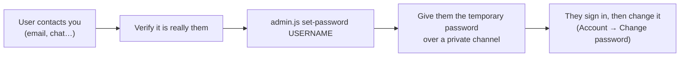

# Administration command line

Administration is done on the **server**, never through the website. That is deliberate: a public sign-up form can never create or promote an administrator, and a forgotten admin password cannot be reset by an attacker.

```
node server/tools/admin.js <command> [user] [options]
npm run admin -- <command> [user] [options]
docker compose -f docker-compose.prod.yml exec kathakaar node server/tools/admin.js <command> …
```

## Commands

| Command | Purpose |
|---|---|
| `create-admin <user> [display name]` | Create an administrator. If the account exists it is **promoted** instead. |
| `create-user <user> [display name]` | Create an ordinary member (useful when sign-up is closed). |
| `set-password <user>` | Set or **reset a forgotten password**. All of that user's sessions are revoked. |
| `promote <user>` / `demote <user>` | Change role between `member` and `admin`. Sessions are revoked so the new role applies immediately. |
| `sign-out <user>` | Revoke every session of a user (e.g. lost laptop). |
| `delete-user <user> [--purge]` | Remove the account and shares. With `--purge` also deletes their stories and images from disk. Refuses to delete the last administrator. |
| `list` | Show all accounts with role and display name. |

## How passwords are supplied

Passwords are **never** accepted as command-line arguments (they would end up in shell history and process lists). Three safe ways:

1. **Interactive** (default on a terminal): hidden prompt, asks twice.
2. **Piped**: `printf '%s\n' "$PW" | node server/tools/admin.js set-password asha`
3. **Environment**: `KATHAKAAR_PASSWORD='…' node server/tools/admin.js create-admin asha`

Minimum length is 8 characters.

## Typical tasks

### First administrator
```bash
node server/tools/admin.js create-admin yourname "Your Name"
```

### A user forgot their password

All their old sessions stop working the moment you run the command.

### The administrator forgot their own password
Run the same command on the server — shell access to the machine is the recovery key:
```bash
node server/tools/admin.js set-password yourname
```

### Remove an abusive user
```bash
node server/tools/admin.js sign-out baduser          # immediate lock-out of existing sessions
node server/tools/admin.js delete-user baduser --purge
```
(Deleting the account stops logins; if you only want to suspend, `set-password` to a long random value without telling the user.)

### Legacy token users
`KATHAKAAR_PASSWORD` unset → `node server/tools/adduser.js <id> [name] [role]` still prints a long-lived bearer token (only its hash is stored). Useful for scripts and bots, not for people.

## Data directory

The CLI reads `KATHAKAAR_DATA` (default `./data`) and `.env`. In Docker run it inside the container so it sees `/app/data`. Changes take effect immediately; the running server notices the file change (mtime) — no restart needed.

## Re-encrypting data (`server/rekey.js`)
If you enable, change or remove `KATHAKAAR_KEY`:
```bash
OLD_KEY=old-passphrase KATHAKAAR_KEY=new-passphrase node server/rekey.js
```
Leave `OLD_KEY` empty when moving from plaintext; leave `KATHAKAAR_KEY` empty to decrypt. It recurses into per-user folders. **Stop the server and back up `data/` first.**
