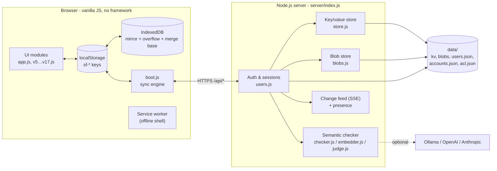
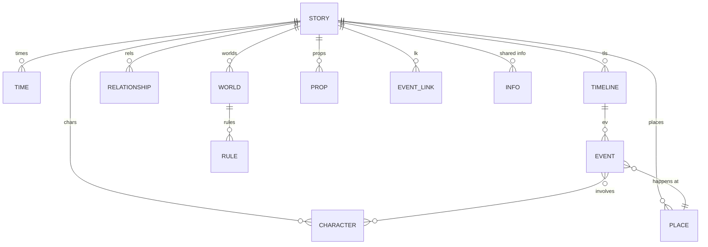
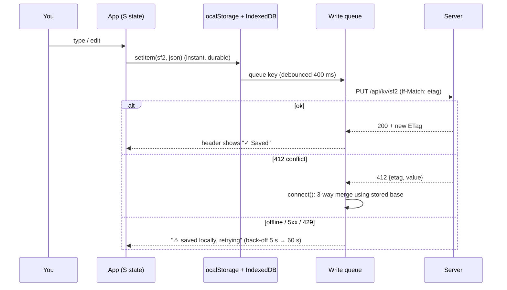
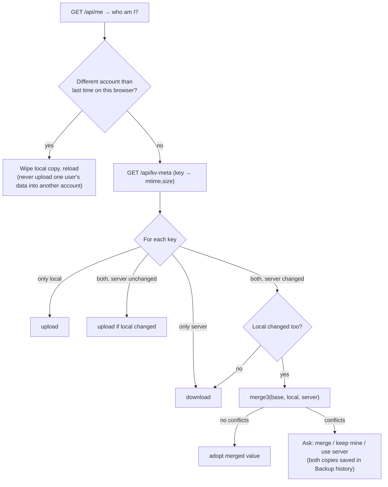
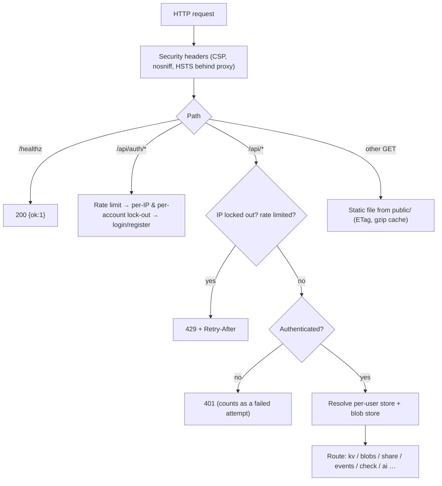
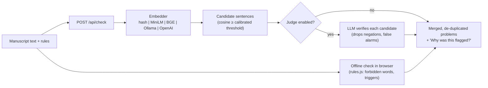

# Architecture

Kathakaar is a **local-first** web app: the browser is the primary place where your story lives, and an optional Node.js server stores a synchronised copy, provides accounts and sharing, and runs the semantic consistency checker. There is **no build step** and **no runtime npm dependency** (the neural embedder is an optional extra).

## 1. The big picture



**Why local-first?** Writing must never be blocked by a network. Every keystroke is saved to `localStorage` immediately; the server is a mirror that catches up when reachable.

## 2. Repository layout

| Path | Purpose |
|---|---|
| `public/index.html` | Single page; loads `keys.js` then `boot.js` |
| `public/js/boot.js` | Storage patching, IndexedDB mirror, **sync engine**, script loader, live feed, sign-in hook |
| `public/js/keys.js` | **Key registry** shared by browser and server: which keys sync, how they validate and merge |
| `public/js/schema.js` | Story schema (version 10), migrations, validation, `merge3` (three-way merge), reference repair |
| `public/js/app.js` | Core planner: state `S`, render loop, Journey map, Matrix, Book renderer, Kathākośa drawer |
| `public/js/v5.js … v17.js` | Feature modules loaded in order (arcs, history, print/EPUB/DOCX export, packs, problems panel, accounts/sharing in `v17.js`) |
| `public/js/ui.js` | Foundation: toasts, dialogs, sign-in dialog, i18n, escaping helpers (`SFX`) |
| `public/js/rules.js`, `lint.js`, `beats.js`, `find.js`, `wlog.js`, … | Pure helpers (also `require()`-able in tests) |
| `public/css/` | `app.css` layout, `theme.css` warm editorial theme (light/dark) |
| `server/index.js` | HTTP server, routing, security headers, rate limits, SSE |
| `server/env.js` | Loads `.env` **before** anything else reads configuration |
| `server/users.js` | Accounts, sessions, ACL (sharing), audit log |
| `server/store.js`, `blobs.js`, `crypt.js` | File storage, content-addressed images, optional AES-256-GCM at rest |
| `server/checker.js`, `embedder.js`, `judge.js`, `aiconfig.js` | Semantic rule checking |
| `server/clip.js` | SSRF-safe page clipper (off by default) |
| `server/tools/admin.js` | Administration CLI |
| `test/` | Node tests (`npm test`) and Playwright/Python browser tests (`test/e2e/`) |

## 3. Data model

A **story** is one JSON document (schema `v10`) stored under a key such as `sf2`, `s1abc…`, `sf-river`.



Other collections (genre packs, inbox, templates, encyclopedia, etc.) are registered in `schema.js` (`COLLECTIONS`). Every collection has a `since` version, so older files are **migrated on load** (`SCHEMA.STEPS`) and newer files produce a warning.

### Storage keys

| Key | Synced | Contents | Merge strategy |
|---|---|---|---|
| `sf-lib` | yes | list of story keys (the Kathākośa) | union |
| `sf-cur` | yes | currently open story | this device wins |
| `sf-ui` | yes | UI settings, saved arc templates, character groups | field-wise merge |
| `sf2`, `s<id>`, `sf-river`, `sf-sunstone` | yes | a story | three-way merge (`merge3`), else ask |
| `sf-snaps-<id>` | yes | history snapshots (max 40) | by `id` |
| `sf-baks-<id>` | yes | automatic backups (max 8) | by `ts` |
| `sf-wlog-<id>` | yes | daily word counts | max per day |
| `xl-token`, `xl-user`, `xl-uname` | **no** | session token, account id, display name | — |
| `xl-sync`, `xl-dirty`, `xl-errors` | **no** | sync bookkeeping, diagnostics | — |

`sf-*` keys are synchronised; `xl-*` keys never leave the device. This rule lives in `keys.js` so browser and server agree.

### Server-side layout

```
data/
├─ kv/                      single-user mode: one JSON file per key
│  └─ u-<account>/          multi-user mode: one folder per account
├─ blobs/                   images, named by SHA-256 of their content
│  └─ u-<account>/
├─ accounts.json            id → {name, role, salt, scrypt hash}
├─ users.json               SHA-256(session token) → {id, name, role, exp}
├─ acl.json                 "<owner>/<story>" → {members:{user: reader|editor}}
├─ audit.log                who / what / when / key (never content); rotates at 5 MB
└─ ai-config.json           AI provider settings incl. API keys (never sent to browsers)
```

## 4. How saving and syncing work



### Connect / merge algorithm (`boot.js › connect`)



* **Base** = the last version both sides agreed on, kept in IndexedDB (`base` store) so a real three-way merge is possible.
* **Live updates:** after connecting, the client opens `GET /api/events` (Server-Sent Events over `fetch`, because `EventSource` cannot send an `Authorization` header). Changes made on another device arrive in about a second; the open story is replaced when you are not mid-edit (3-second quiet period).
* **Offline:** the service worker serves the app shell; writes queue (`xl-dirty` survives reloads) and flush on reconnect.
* **Storage full:** if `localStorage` (~5 MB) overflows, values are kept in memory + IndexedDB and a warning is shown; export your library.

## 5. Request lifecycle on the server



Key points:
* **Namespacing:** in multi-user mode the account id selects the folder (`kv/u-<id>`, `blobs/u-<id>`). A user can only reach another user's data through the `/api/shared/...` routes, which consult the ACL on every request.
* **Validation:** every value written to `/api/kv/<key>` is validated against the key registry and story schema (HTTP 400 on failure). Limit: 5 MB per value.
* **Concurrency:** writes are atomic (temp file + rename). Optimistic concurrency uses `ETag` / `If-Match`.
* **Encryption at rest (optional):** `KATHAKAAR_KEY` encrypts every kv file with AES-256-GCM (`SFE1` header + nonce + ciphertext + tag).

## 6. Semantic rule checking



If the server or model is unavailable the offline check still runs. API keys live only in `data/ai-config.json`; in multi-user mode only administrators can change them.

## 7. Design decisions

| Decision | Reason |
|---|---|
| No framework / bundler | Zero build, tiny attack surface, easy to self-host and audit |
| Files instead of a database | Simple backups (`tar`), easy encryption, enough for text documents |
| Last-writer-wins avoided via `merge3` | Two devices editing the same story must not silently lose text |
| Content-addressed images | Duplicates stored once; integrity verified by hash |
| Session tokens stored hashed | A leaked `users.json` does not leak usable sessions |
| Admin only via CLI | Public sign-up can never escalate to administrator |

## 8. Known architectural limits

* `app.js` and `v5.js` are large single files with global functions; refactor into modules before adding big features.
* `store.all()/meta()` read directories synchronously — fine for thousands of keys, not millions.
* Undo keeps up to 60 full-story snapshots in memory.
* Shared stories are copied, not co-edited live (the server API for editor write-back exists).
