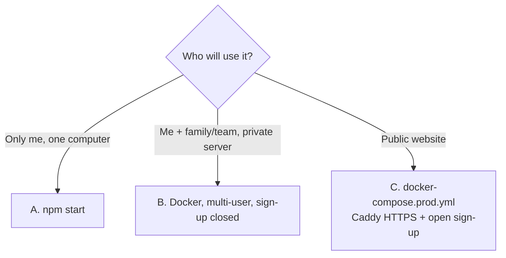
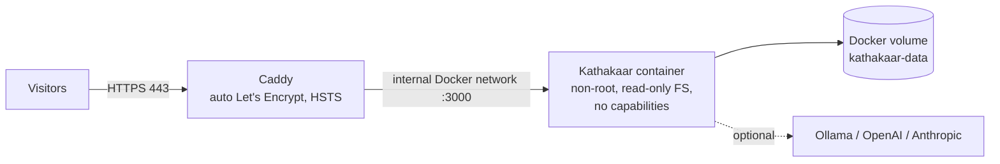

# Deployment guide

Three ways to run Kathakaar, from simplest to production.



## A. Local (no Docker)

Requirements: Node.js ≥ 18.
```bash
npm start                     # http://localhost:3000, binds to 127.0.0.1
npm run setup-model           # optional: better semantic matching (~100 MB)
npm test                      # run the test-suite
```
Data is kept in `./data` and in your browser. Nothing leaves your machine.

## B. Private server with accounts

```bash
cp .env.example .env
# edit: KATHAKAAR_MULTIUSER=1  KATHAKAAR_SIGNUP=0  HOST=0.0.0.0
node server/tools/admin.js create-admin yourname
node server/tools/admin.js create-user  friend "Friend Name"
npm start
```
Put HTTPS in front (Caddy/nginx) before exposing it beyond a trusted network.

## C. Public deployment (recommended stack)



### Step by step
1. **Server**: a Linux VM with Docker + Compose (1 vCPU / 1 GB RAM is enough with `WITH_MODELS=0`; use 2+ GB for `WITH_MODELS=1`).
2. **DNS**: create an `A` (and `AAAA`) record for your domain pointing at the VM.
3. **Firewall**: allow inbound 80 and 443 only (80 is needed for certificate issuance and redirects).
4. **Configure**
   ```bash
   cp .env.production.example .env.production
   nano .env.production            # DOMAIN=write.example.com …
   ```
5. **Start**
   ```bash
   docker compose -f docker-compose.prod.yml --env-file .env.production up -d --build
   docker compose -f docker-compose.prod.yml logs -f
   ```
6. **Create the administrator**
   ```bash
   docker compose -f docker-compose.prod.yml exec kathakaar node server/tools/admin.js create-admin yourname
   ```
7. **Verify**: open `https://your-domain`, create a test account, write a chapter, reload, sign out and in again. Check `https://your-domain/healthz`.

### What the production compose file does
| Setting | Why |
|---|---|
| `expose: 3000` (not `ports`) | The app is reachable only through Caddy |
| `TRUST_PROXY=1` | Correct client IPs for rate limits; disables local-admin shortcuts |
| `KATHAKAAR_MULTIUSER=1`, `KATHAKAAR_SIGNUP=1` | Public accounts; set `0` for invitation-only |
| `KATHAKAAR_QUOTA_MB=50` | Cap storage per user |
| `KATHAKAAR_CLIP=0` | No server-side web fetching |
| `read_only`, `cap_drop: ALL`, `no-new-privileges`, tmpfs `/tmp` | Container hardening |
| healthcheck on `/healthz` | Auto-restart on failure |

### Using another reverse proxy
Forward to `kathakaar:3000`, add `X-Forwarded-For` and `X-Forwarded-Proto`, set `TRUST_PROXY=1`, allow request bodies up to 25 MB and **do not buffer** `/api/events` (Server-Sent Events). For nginx: `proxy_buffering off; proxy_read_timeout 1h;` on that location.

## Backups

| What | How |
|---|---|
| Everything | `docker run --rm -v kathakaar_kathakaar-data:/d -v $PWD:/b busybox tar czf /b/kathakaar-$(date +%F).tgz -C /d .` |
| One user | Ask them to use **Data → Export all** (JSON) |
| Server-side export | `GET /api/export` (per user, NDJSON) |
Automate with cron and copy off-site. Test a restore: extract the archive into a fresh volume, start the stack, sign in.

> The volume name is `<project-folder>_kathakaar-data`; run `docker volume ls` to confirm.

## Updating
```bash
git pull
docker compose -f docker-compose.prod.yml --env-file .env.production up -d --build
```
Users receive an "Update available — Reload" toast (service worker). Story files are migrated automatically when opened.

## Monitoring
* `GET /healthz` (uptime monitor, expects `{"ok":1}`)
* `docker compose logs`; set `KATHAKAAR_LOG=1` for request logs
* `data/audit.log` for account activity
* Disk space: quotas are per user, so total usage = users × 50 MB worst case

## Scaling notes
One Node process, file storage and in-memory live feed → **single instance only** (do not run replicas behind a load balancer). It comfortably serves hundreds of light users; for thousands, move storage to a database first.

## Before you launch publicly
Publish a privacy policy and terms, decide your moderation/takedown process, set up backups, and read [SECURITY.md](SECURITY.md).
