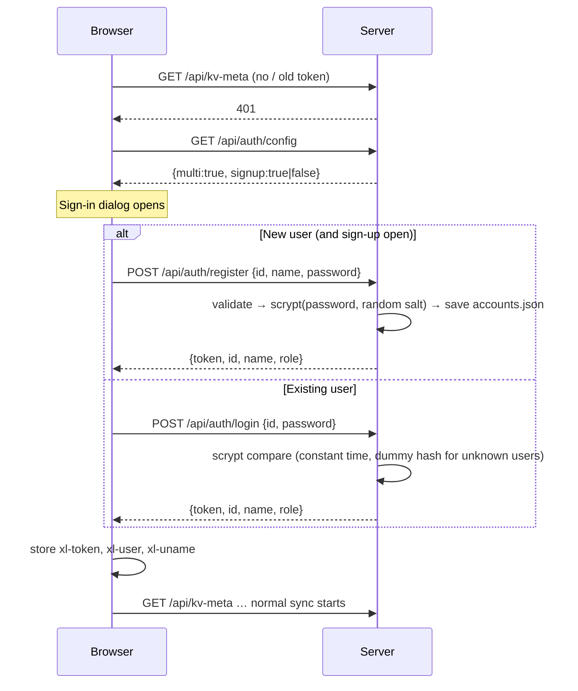
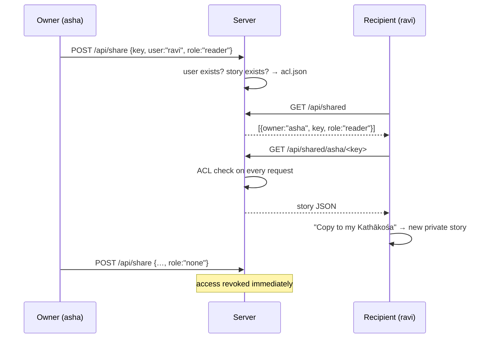

# Multi-user accounts, sessions and sharing

Kathakaar can run in three authentication modes. Pick one in `.env` — the server decides at startup.

| Mode | Turn on with | Who can use it | Data layout |
|---|---|---|---|
| **Open (single user)** | nothing | anyone who can reach the server; binds to `127.0.0.1` by default | `data/kv/` |
| **Shared token** | `KATHAKAAR_TOKEN=secret` | everyone with the token shares **one** library | `data/kv/` |
| **Accounts (multi-user)** | `KATHAKAAR_MULTIUSER=1` | each person has a username + password and a **private** library | `data/kv/u-<id>/` |

> For a public website use **Accounts**. The rest of this page describes that mode.

## 1. Concepts

* **Account** – username (3–32 chars: letters, digits, `_`, `-`; stored lower-case), display name, password, role.
* **Role** – `member` (write stories, share) or `admin` (also change AI Engine settings and see diagnostics). Admins are created **only through the CLI** (see [ADMIN_CLI.md](ADMIN_CLI.md)); the single exception is the very first account created from the server machine itself, not through a proxy.
* **Session** – after login the server returns a random 256-bit token. The browser sends it as `Authorization: Bearer <token>`. The server stores only `SHA-256(token)` plus an expiry (default 30 days, `KATHAKAAR_SESSION_DAYS`).
* **Library ownership** – everything an account writes goes into its own folder; nobody else (including other members) can read it unless it is shared.

## 2. Sign-up and sign-in flow

### Rules the server enforces
* Password: 8–200 characters. Hashed with **scrypt** (N=16384, r=8, p=1, 16-byte random salt).
* Reserved usernames cannot be registered by the public: `admin`, `administrator`, `root`, `system`, `support`, `kathakaar`, `moderator`, `staff`, `null`, `undefined`, `api`.
* Sign-up limit: **10 per hour per IP** (`KATHAKAAR_SIGNUPS_PER_HOUR`).
* Login protection: **10 wrong passwords per account** → 15-minute lock; repeated failures from one IP → exponential lock-out up to 1 hour. Unknown usernames take the same time as wrong passwords (no user enumeration by timing).
* `KATHAKAAR_SIGNUP=0` closes public registration (invitation-only; the admin creates accounts with the CLI).

## 3. Account menu (sidebar → Account)

| Action | What happens |
|---|---|
| **Change password** | Needs the current password; **all other sessions are signed out**, this one stays. |
| **Sign out** | Revokes this session on the server, then removes this account's local copy from the browser (it remains on the server). If changes are still unsent you are warned first. |
| **Delete my account** | Confirm with your password. Deletes the account, sessions, all stories and images, and removes you from other people's shares. Irreversible. |

## 4. Switching accounts on one browser

Local copies belong to exactly one account. When a different account signs in (or the identity reported by the server differs from `xl-user`), Kathakaar **wipes the local copy first** and then syncs from the server. This prevents user A's stories from being uploaded into user B's account on a shared computer.

If you used Kathakaar anonymously before creating an account, the **first** sign-in on that browser keeps those local stories and uploads them to your new account.

## 5. Sharing a story

Open **Kathākośa**, press **Share** on a story, type a username, choose a role and press *Share*.

| Role | Can read | Can write through the API | Can remove sharing |
|---|---|---|---|
| `reader` | yes | no (HTTP 403) | no |
| `editor` | yes | yes (`PUT /api/shared/<owner>/<key>` with `If-Match`) | no |
| owner | yes | yes | yes |

* The recipient sees it under **Kathākośa → Shared with me** and can **copy it into their own library**.
* Deleting a story removes its shares. Deleting an account removes that account from all shares.
* Stories are copied, not live co-edited; if you need co-writing, give the person editor access and integrate via the API, or share exports.
* Live presence (`POST /api/presence`, `sf:presence` event) exists on the server for "X is editing Chapter 7" banners; the UI for it is not built.

## 6. Quotas and limits

| Limit | Default | Setting |
|---|---|---|
| Storage per account (stories + images) | 50 MB | `KATHAKAAR_QUOTA_MB` (0 = unlimited) |
| Single story value | 5 MB | fixed |
| Single image | 5 MB | fixed |
| API calls | 600/min/IP | `RATE_LIMIT` |
| Sign-ups | 10/hour/IP | `KATHAKAAR_SIGNUPS_PER_HOUR` |

## 7. What is logged

`data/audit.log` records `{time, user, action, key}` for writes, deletes, shares, logins, registrations, password changes and account deletions. **Never content.** The file rotates at 5 MB (`audit.log.1`). Tell your users about this in your privacy policy.

## 8. Files used

| File | Content | Sensitive? |
|---|---|---|
| `accounts.json` | usernames, display names, roles, salted scrypt hashes | yes – mode 0600 |
| `users.json` | hashed session tokens + expiry | yes – mode 0600 |
| `acl.json` | who shared what with whom | moderate |
| `audit.log` | action log | moderate |

All files are written atomically (temp file + rename). A damaged `users.json` never disables authentication: the server keeps the last good copy in memory and, once multi-user mode is on, stays on.
