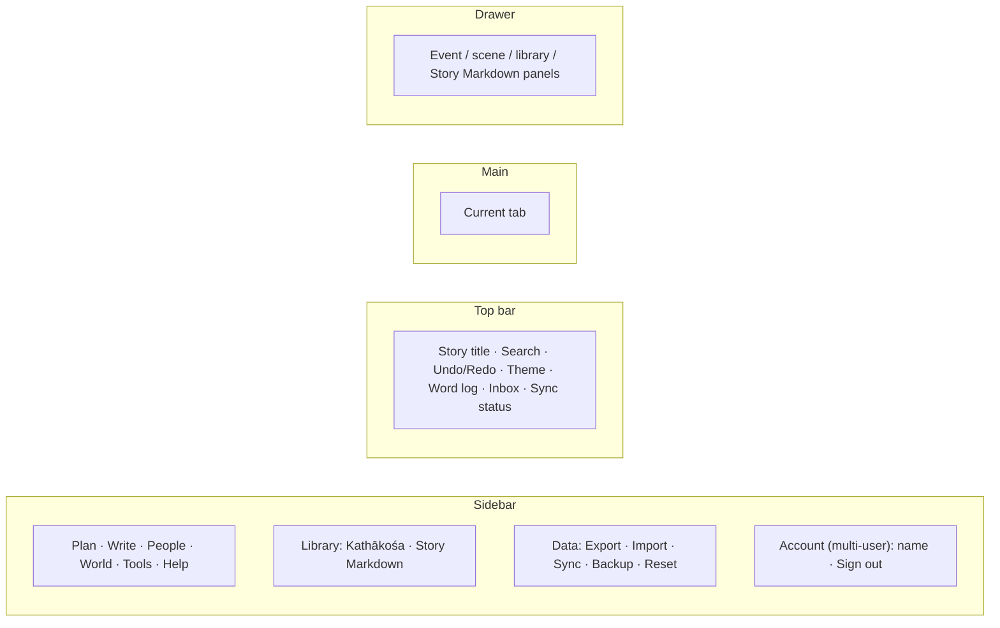
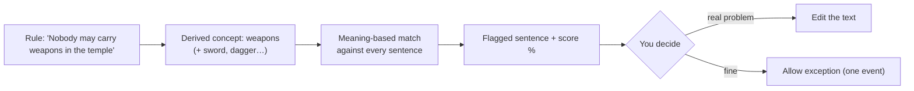

# User guide

Kathakaar is a story planner and writing studio. You plan *what happens, where, when and to whom*, write the manuscript inside the plan, and let the app warn you when something contradicts itself.

## 1. The five-minute start

1. **Create an account** (public site) or just open the app (personal install).
2. Open **Kathākośa** (sidebar → Library). Two finished example stories are included: *The Secret of the Sunstone* and *The Secret of the Singing River*. Explore them; **Restore original** resets them.
3. Press **+ New story**. Give it a title in the top bar.
4. **People → Characters**: add your cast. **World → Places**: add locations.
5. **Plan → Journey map**: double-click a lane to create an **event** (a scene/chapter). Set title, place, characters, notes and **Manuscript text**.
6. **Write → Book / Script**: your events appear as chapters. Export when ready.
7. **World → Worlds & Rules** → *Run semantic check* to catch contradictions with your own rules.

## 2. Screen layout

* **Sync chip** (top bar): *✓ Saved*, *⚠ saved locally, retrying* (offline), *Sign in needed*. Nothing is lost offline.
* **Command palette**: `Ctrl/⌘+K`. Prefix `@` characters, `#` chapters, `/` places.
* The sidebar collapses to icons with «.

## 3. Library: Kathākośa and Story Markdown

| Item | What it is |
|---|---|
| **Kathākośa** (कथाकोश, "treasury of stories") | **The list of all your stories.** Open, duplicate, delete, import, **Share** (multi-user) and see **Shared with me**. Built-in examples cannot be deleted (use *Restore original*). |
| **Story Markdown** | The **current** story rendered as one Markdown document (cast, places, timeline, notes). Copy it or download `.md` for wikis, Obsidian, or an AI assistant. It is a read-only export. |

## 4. Plan

### Journey map
One lane per timeline (e.g. *Past* and *Present*). Double-click a lane to add an event; drag boxes to change time/lane; drag from a box's handle onto another box to draw an arrow (dashed = crosses timelines or goes back in time). Character chips filter the view. The side panel edits title, place, "also at", mood, health, notes, manuscript text and which world's rules apply.

### Corkboard & Kanban
Chapters as cards with word count vs. target and status (**Idea → Draft → Revised → Final**). Drag, or focus a card, `Space` to lift, arrows to move, `Space` to drop, `Esc` to cancel. Select several cards for bulk status change, split or merge. Kanban mode groups by status.

### Matrix
Places × times grid showing which characters are where, with mood, clothing, health, powers. A ⚠ appears when someone is in two places at once.

### Life timeline
Each character's life as a lane (birth year gives ages). Compare overlapping lives; colour shows health.

### Calendar
Define your own months, weekdays, holidays and a moon cycle; the checker warns if a scene says "full moon" on the wrong night.

## 5. Write

### Book / Script
Events become chapters (novel) or scenes (screenplay). In screenplay mode `KAEL: We should go.` becomes dialogue. **Edit final** lets you polish the rendered text per chapter (find & replace, revert, stale-plan warning, word goal). **Focus mode 🖋**: full-screen single chapter, session word count.
Exports: copy, **Print/PDF**, **.docx**, **.epub** (validated), **.fdx**, **.fountain**, **.txt**, Scrivener-ready ZIP. Imports: `.fdx`, `.fountain`, `.docx`, `.rtf`, `.md`, Scrivener ZIP.

### Craft
Style lint (suggestions only: passive voice, filter words, "tell" words), readability by age band, beat sheets (Save the Cat, Hero's Journey…), compare versions, name generator, print layout (trim size, bleed, preflight), ebook/paperback cover, serial-platform export (Royal Road, Wattpad, AO3, Substack, Ream).

### Genre packs
Switch on Mystery, Romance, Fantasy/Sci-Fi, Historical, Horror, Comedy, Literary, Screenwriting, YA/MG or Research & family. Each adds ledgers (clues, magic systems, motifs…), event-drawer sections and checks. Turning a pack off only hides it.

### Tension & emotion, Story weave
A curve built from event moods with pacing hints; a braid chart of which threads/characters appear in which chapters.

### History (snapshots)
`Ctrl/⌘+S` saves a snapshot; automatic ones are taken on a timer and before risky actions. Compare paragraph-by-paragraph; restore one chapter or the whole manuscript.

## 6. People

* **Characters** – name, role, colour, *nature & traits* (read by the rules checker), goal, flaw, secret.
* **Relationships** – typed links (Friend, Ally, Mentor, Rival, Romance…) with notes and years.
* **Relationship arcs** – beats (closeness −5…+5) anchored to events; compare people/groups; choose an intended arc from 25+ genre templates and see drift.
* **Shared info** – who knows what, where and when.

## 7. World

* **Worlds & Rules** – rules by category with ON/OFF switches.
* **Places** – nested profiles (room → building → city), "Events here".
* **World map** – upload an image, drop pins, calibrate scale; travel-time warnings.
* **Encyclopedia** – auto-entries linked with `[[Name]]`, `[[Name|text]]`, `[[character:Name]]`; broken links are reported.
* **Props** – objects with a custody log (holder, place, state). Problems: used after destroyed, appears without holder, never used.
* **Mood board** – reference images (alt text required).

## 8. How rules are checked

* **Forbidden words** – comma-separated; `*` wildcard (`fly*`).
* **Triggers** – `gold + water|river` means *both groups must appear in the same scene* (character traits count).
* **Sensitivity** – *Strict* finds more (more false alarms), *Loose* fewer.
* Negation ("never flew") is reported as *check context*.
* If a derived concept is wrong, type the exact words into **Forbidden words**.
* Better engines: AI Engine tab (MiniLM, BGE, Ollama, OpenAI, Anthropic verifier).

## 9. Data, backup and sync

| Question | Answer |
|---|---|
| Where is my story? | In your browser (localStorage + IndexedDB) **and**, when signed in, on the server. |
| Does it work offline? | Yes. Edits queue and sync later. |
| Two devices? | Changes merge automatically; true conflicts ask you (both versions are kept in Backup history). |
| How do I back up? | **Export** (single story JSON), **Data → Export all** (whole library incl. snapshots), **Backup** (last 8 automatic copies). |
| Import? | **Import** a story; **Import all** never overwrites an existing story. |
| Storage full? | Browser limit ≈ 5 MB; Kathakaar spills to IndexedDB and warns you. Export and prune old snapshots. |

## 10. Keyboard shortcuts

| Keys | Action |
|---|---|
| `Ctrl/⌘+K` | Command palette & search |
| `Ctrl/⌘+Z` / `Y` | Undo / redo |
| `Ctrl/⌘+S` | Save history snapshot |
| `Ctrl+Shift+I` | Inbox (quick idea capture) |
| `Ctrl+Shift+M` | Problems panel (all checks in one list) |
| `Space`, arrows, `Esc` | Grab / move / cancel on Corkboard and map pins |

## 11. Accounts and sharing (public / multi-user installs)
See [MULTI_USER.md](MULTI_USER.md). In short: sign in from the dialog, **Sign out** and **Account** live at the bottom of the sidebar, **Share** is on every story card in Kathākośa.

## 12. Glossary

| Term | Meaning |
|---|---|
| Event | One box on the Journey map; becomes a chapter or scene |
| Timeline | A lane of events |
| Matrix cell | A place × time slot with the characters' state |
| Prop | A tracked object with a custody log |
| World / Rule | A set of constraints your story must obey |
| Pack | A genre toolkit enabled per story |
| Drawer | The side panel for an event, extended by packs |
| Kathākośa | Your library of stories |
| Story Markdown | Markdown export of the current story |
